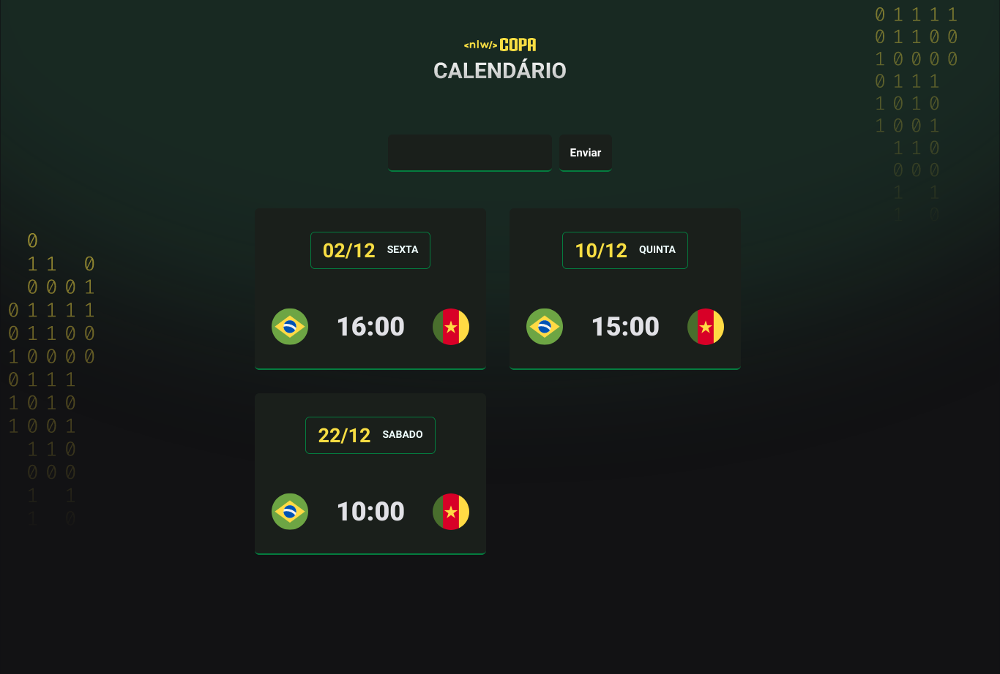

<h1 align="center"> ⚽ NLW 10# Copa ⚽</h1>

Projeto feito para o nlw 10# da rocketseat usando tecnlogias WEB

  <a href="#-tecnologias">Tecnologias</a>&nbsp;&nbsp;&nbsp;|&nbsp;&nbsp;&nbsp;
  <a href="#-projeto">Projeto</a>&nbsp;&nbsp;&nbsp;|&nbsp;&nbsp;&nbsp;
  <a href="#-layout">Layout</a>&nbsp;&nbsp;&nbsp;|&nbsp;&nbsp;&nbsp;
  <a href="#memo-licença">Licença</a>

  

  
  Projeto concluído.

## ⚠️ Aviso
- O input de texto não funciona

## 🚀 Tecnologias

- HTML e CSS
- JavaScript
- Git e Github
- Figma

## 💻 Projeto
Calendário da copa que mostra datas e horários dos jogos.

O projeto pode ser visualizado através [desse link](https://miask3011.github.io/nlw-10-copa/)

## 🔖 Layout
É possível acessar o layout através [desse link](https://www.figma.com/file/3vJag61Mwp00SpzFtf8pgc/Calend%C3%A1rio-de-Jogos-(Community))

## :memo: Licença

Esse projeto está sob a licença MIT.
